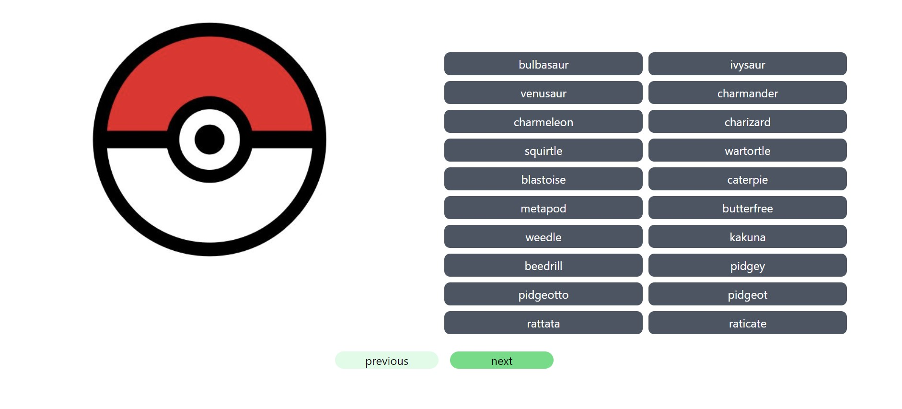
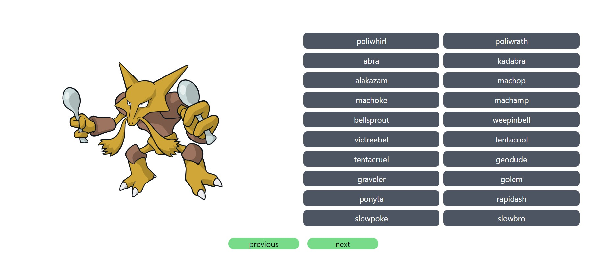
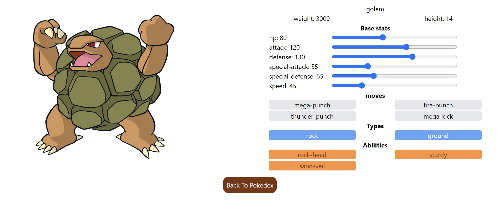

# Pokédex App

Una aplicación de Pokédex desarrollada con React, Vite, Tailwind CSS y Cypress.

## Demo

[Ver demo en línea](https://reactpruebatecnica-production.up.railway.app/pokedex) 


## Descripción

Esta aplicación de Pokédex te permite explorar y buscar información sobre diferentes Pokémon. Puedes ver detalles como tipos, habilidades, estadísticas y más.





## Características

- Búsqueda paginada de Pokémon.
- Visualización de detalles de Pokémon.

## Instalación

Para ejecutar la aplicación en tu entorno local, sigue estos pasos:

1. Clona este repositorio:

   ```bash
   git clone https://github.com/tu-usuario/pokedex-app.git

2. Navega al directorio del proyecto:

   ```bash
   cd prueba-front-react
   
3. Instala las dependencias:

   ```bash
   npm install
   
4. Inicia la aplicación:

   ```bash
   npm run dev

5. Abre tu navegador y navega a http://localhost:5173

## Pruebas 
Este proyecto utiliza Cypress para realizar pruebas de extremo a extremo. Para ejecutar las pruebas, asegúrate de tener la aplicación en ejecución y luego ejecuta:

## Tecnologías utilizadas


- [React](https://reactjs.org/)
- [Vite](https://vitejs.dev/)
- [Tailwind CSS](https://tailwindcss.com/)
- [Cypress](https://www.cypress.io/)


